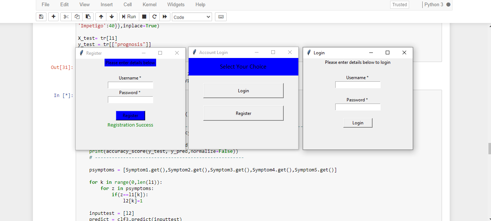

# Disease prediction using symptoms
this is a project for predicting diseases using the data set of given symptoms.We have used Machine learning algorithm, Decision Tree to predict the disease along with the accuracy.
## GUI
interface used-tkinter

## Requirements
*Python 2.7 or Python 3.6

*Jupyter Notebook
## Dependencies
*pandas
*numpy
*matplotlib
*sklearn
*keras
*tensorflor
